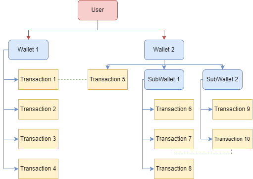
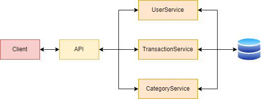

# Towech - FinanceApp
This repository is to serve a basic example of the complete application as well as to serve as a front for the documentation, the repositories that form the complete app can be found [here](https://github.com/towech-financeapp).

The Towech FinanceApp is a web based application that allows users to manage their personal finances by having multiple wallets, creating/editing transactions and managing transferences between them.

The application uses a _microservice_ approach by containerizing parts of the code so they can be easily scaled in case it is needed. Due to the smaller scope of the application this is completely overkill, however it is meant to easily learn how these kinds of applications can be created.

## Table of Contents
1. [Architecture](#Architecture)
    1. [Data](#Arch_Data)
    2. [Application](#Arch_App)
    3. [Infraestructure](#Arch_Infraestructure)
2. [Installation](#Installation)
    1. [External requirements](#Inst_ext)
    2. [Installing example](#Inst_exa)
3. [Credits](#Credits)

## Architecture

### Data Architecture
The application mainly consists of managing the information contained within 4 datatypes:

__Categories:__ Categories are simple tags that indicate types for transactions, indicate if they are either Income or Expense.

__Transactions:__ Transactions are the main way the finances are managed, they contain a category, concept and most importantly, an amount. All transactions require to have a wallet they belong to.

__Wallets:__ Wallets are collections of transactions, by grouping the transactions together, different "accounts" or "budgets" can be managed. By using wallets, transactions can be linked together to represent transferences between them. Wallets can also contain SubWallets which allow to further subdivide the transactions, only two layers of Wallets are allowed.

__Users:__ Users are the topmost data type, each user is able to create wallets that allow them to manage their finances. This datatype contains all the necessary information to authenticate.

### Application
The application is divided in parts that communicate together, due to the microservice oriented nature of the project, each part of the application can be separated. 

[__WebClient:__](https://github.com/towech-financeApp/WebClient) A ReactJS based web frontend application that serves as the UI of the project. It allows the users to do all the functions the application has. It communicates with the API.

[__API:__](https://github.com/towech-financeApp/WebApi) An ExpressJS API that handles the authentication parameters, as well as passing any http request to the services to be processed.

[__UserService:__](https://github.com/towech-financeApp/UserService) Worker that contains all the logic and rules the data regarding the users should follow, such as password changes, adding users, registering the amount of active sessions etc. Also is in charge of the mailing system for the application.

[__TransactionService:__](https://github.com/towech-financeApp/TransactionService) Worker that manages both the wallets and the transactions, is in charge of adding/editing/deleting, both wallets and transactions. Manages the transferences between wallets and ensures the totals add up.

[__CategoryService__](https://github.com/towech-financeApp/CategoryReportService) Worker in charge of the categories, currently is the most unused service, however future upgrades will allow it to generate reports of a determined time.

__Database:__ The application uses a MongoDB database to keep all the information.

## Credits
- Jose Tow [[@Tow96](https://github.com/Tow96)]
